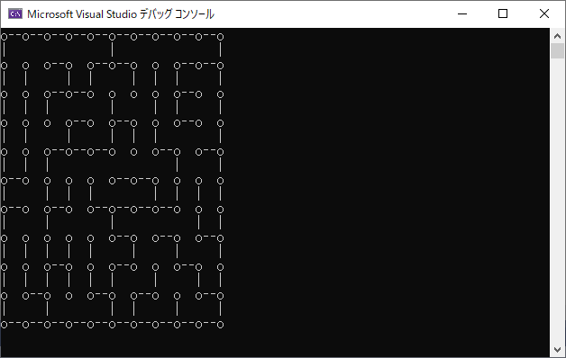

# libMaze

This library allows you to make a maze.  

## Interfaces of dll

- **void Generate(int rowNum, int columnNum)**  
Initialise the maze.  
You should conduct this function before calling other functions.  
   - *rowNum*: The number of rows of the maze.  
   - *columnNum*: The number of columns of the maze.  
- **bool ExistTopWall(int row, int column)**  
Get whether the target cell has wall on the top edge.
   - *row*: The row index of the target cell. Start from 0.  
   - *column*: The column index of the target cell. Start from 0.  
- **bool ExistRightWall(int row, int column)**  
Get whether the target cell has wall on the right edge.
   - *row*: The row index of the target cell. Start from 0.  
   - *column*: The column index of the target cell. Start from 0.  
- **bool ExistBottomWall(int row, int column)**  
Get whether the target cell has wall on the bottom edge.
   - *row*: The row index of the target cell. Start from 0.  
   - *column*: The column index of the target cell. Start from 0.  
- **bool ExistLeftWall(int row, int column)**  
Get whether the target cell has wall on the left edge.
   - *row*: The row index of the target cell. Start from 0.  
   - *column*: The column index of the target cell. Start from 0.  

## Example
The testMaze project in this repository uses libMaze.  

The result of generating a 10x10 maze is this.  

